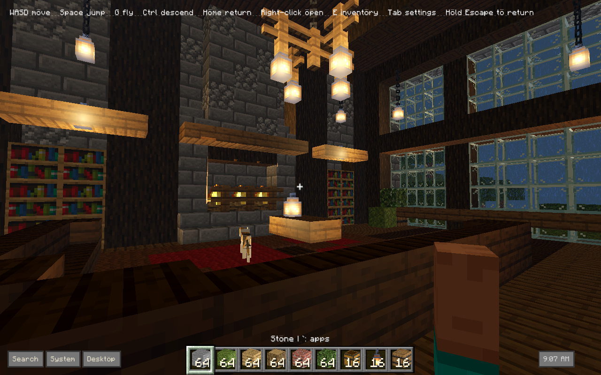
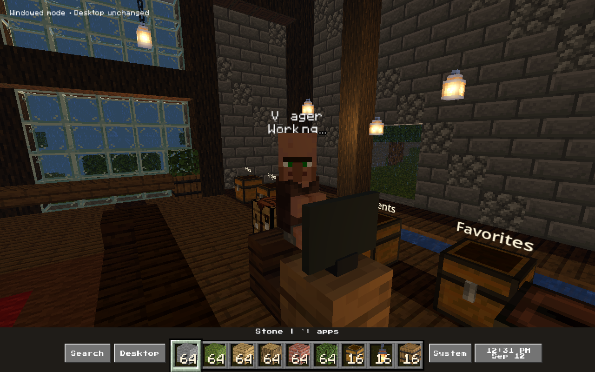
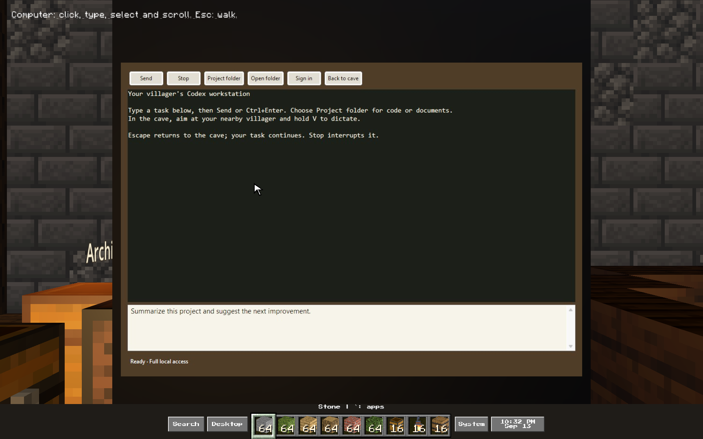

# Minecraft Desktop

A Minecraft-inspired desktop that turns everyday computing into an interactive world. Organize files in chests, browse the web on an in-world TV, and put AI agents to work as villagers at their own computers.

I wanted the desktop to feel like a room I could spend time in. This project brings everyday tools into a Minecraft-inspired cave, with a rainy view, a fireplace, and space to build.

## Inside the cave

**Villager agents.** Give a villager a coding, research, or writing task through text or voice. It sits at its computer while an AI agent works. Click the monitor to zoom in and control the same workstation directly in the world. Escape returns to walking.

The workstation up close: type a task, follow its progress, and return to the room with Escape.

**Interactive web TV.** The screen runs a live WebView2 browser. Aim and click to pause a video, type a search, or scroll through YouTube without leaving the room. TV and computer screens are movable black concrete blocks: hold to break and collect, then place matching blocks together for a larger display.

**Files you can organize.** Chests hold links to real files and folders, with Windows icons, thumbnails, and folder navigation. Carry links between chests or move an entire chest with its contents intact. The original files stay where they are.

**A working desktop.** Switch applications through the hotbar, choose between open windows, and return to the cave. Keep notes in a book, put photos in frames, and rearrange the room around your desk.

## Built with

C# and Godot 4 handle the world and interactions. A .NET Windows helper connects it to the desktop through Win32, hosts the browser, and runs the agent workstation. Local IPC carries commands and screen frames between them.

- **AI integration:** persistent Codex sessions, JSON-RPC, streamed output, voice input, task review, and interruption.
- **Browser integration:** WebView2 frames rendered on a 3D surface, with mouse and keyboard input routed back to the page.
- **Windows integration:** desktop attachment, application switching, window previews, and focus handling.
- **Persistence:** versioned saves, atomic writes, backups, and protection against conflicting sessions.

[How it works](docs/ARCHITECTURE.md) · [Build and controls](docs/DEVELOPMENT.md) · [Tests](https://github.com/mjtraf/minecraft-desktop/actions)

## Status

A working Windows 11 prototype. The screenshots show the local build; the full Minecraft resource pack and packaged app are not included. Running the cave requires a compatible resource pack. [Asset details](ASSETS.md).

The current agent integration supports one Codex workstation. Desktop behavior and performance still need testing on more machines. The agent can operate on real files and applications using the signed-in user's access.

Built with Codex assisting implementation, debugging, and testing, alongside hands-on design and iteration.

---

Unofficial fan project, not affiliated with Mojang or Microsoft. Press Start 2P is included under the [SIL Open Font License](Assets/Fonts/OFL.txt). No general source-code license has been selected.
