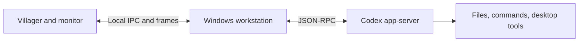

# How it works

Godot renders the world. A C# Windows helper connects it to files, applications, browser video, and Codex. They communicate locally, with separate channels for commands and screen frames.

| Location | Role |
| --- | --- |
| `Game/` | World rendering, movement, building, inventory, and interaction |
| `src/Cave.Desktop/` | Windows integration, browser host, and agent workstation |
| `src/Cave.Core/` | File links, saved state, placement, and water simulation |
| `Shared/` | IPC and frame transport |
| `tests/` | File, persistence, simulation, and transport checks |

## Villager agent

A villager represents a persistent Codex session. You can type a task or hold V while aiming at the villager to dictate, then review the text before sending. While the agent works, the villager sits at its computer. Open that computer for the full transcript and controls.

The [session client](../src/Cave.Desktop/VillagerSession.cs) communicates with `codex app-server` over JSON-RPC on standard input/output. It resumes threads, streams responses, tracks task status, and interrupts turns. The [workstation](../src/Cave.Desktop/VillagerWorkstation.cs) handles input, approval requests, speech recognition, and transcript persistence.

The [desktop adapter](../src/Cave.Desktop/AgentDesktop.cs) exposes screenshots, clicks, scrolling, text, and keys. These operate on the real desktop with the user's access. The current version supports one Codex workstation and requires a separately authenticated CLI.

## Web TV

The TV is a live [WebView2 browser](../src/Cave.Desktop/CaveTv.cs). Captured frames pass through [shared frame transport](../Shared/TvFrameBuffer.cs) to a Godot texture. The [TV controller](../Game/Television.cs) maps input on the 3D screen back to the browser, including clicks, scrolling, and typing.

Browser rendering and game rendering run separately. The player supports navigation, mute, volume, power, and a larger viewing window. Frame rate depends on browser state and the host machine.

## Desktop and input

The [Windows helper](../src/Cave.Desktop/Program.cs) attaches the cave to the desktop, manages application windows, and restores desktop icons on exit. A watchdog handles helper failure.

Movement uses a captured pointer; menus, web content, and Windows need a free pointer. Focus transitions explicitly release capture and reset held inputs to prevent stuck movement or repeated clicks. The app dock includes grouped window previews and close controls.

## Files and saves

Chest contents are links managed by the [file service](../src/Cave.Core/FileService.cs). Moving a link between chests leaves its target in place. A packed chest keeps its identity and contents when placed again.

The [state store](../src/Cave.Core/StateStore.cs) writes versioned records atomically and keeps recovery backups. A session lock and stale-write checks protect against two instances overwriting the same world. Notes, placed objects, terrain edits, and inventory persist alongside file organization.

## Tests and current limits

[GitHub Actions](https://github.com/mjtraf/minecraft-desktop/actions) runs 41 core checks and three transport checks on Windows. These cover source-file integrity, discovery, duplicate links, save recovery, placement, water flow, message ordering, and stalled peers.

Additional in-app checks require the resource pack and an interactive desktop. Desktop attachment, microphone input, recording, and multi-monitor behavior need broader testing across PCs. Block interactions cover a subset of Minecraft behavior.
