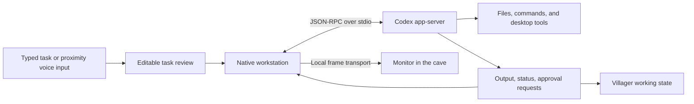

# Minecraft Desktop: engineering case study

## Purpose and contribution

The project asks whether a familiar game environment can become a useful interface for everyday desktop work. A chest gives files a physical location; a TV makes browser media part of the room; a villager gives an AI task a visible presence.

The creator supplied the concept, feature priorities, visual direction, and repeated usability feedback. Development was assisted by Codex for implementation, debugging, testing, and documentation. This portfolio demonstrates creative direction, iterative product development, and applied agent integration. It does not claim a custom-trained model, a complete Minecraft engine, or production-scale deployment.

## AI agent integration

The current implementation supports one villager workstation connected to Codex. It is a real task session, with a dedicated native UI, rather than a scripted character response or an embedded copy of the existing Codex desktop app.

The [session client](../src/Cave.Desktop/VillagerSession.cs) starts or resumes a thread, correlates requests with responses, consumes streamed events, and supports interrupting a turn. The [workstation](../src/Cave.Desktop/VillagerWorkstation.cs) presents text, project selection, approvals, and optional Windows speech recognition. Spoken input is reviewed before submission. Thread identity and transcript are persisted separately from the world.

The [desktop adapter](../src/Cave.Desktop/AgentDesktop.cs) provides screenshot, click, move, scroll, text, and key operations through local request/result files. These operate on the real desktop. The integration uses the user's authenticated Codex CLI; no account credentials are committed. It is configured for broad local access, so it is not a hardened multi-user sandbox. Approval handling and cancellation are part of the UI, not a claim that every possible agent action is safe.

**What this demonstrates:** event-driven integration of an existing AI agent; translating task state into a spatial UI; voice review; human oversight; persistent sessions; and connecting useful tool execution to a novel interface. Multiple providers and multi-villager orchestration remain future work.

## Interactive web TV

The [Windows browser host](../src/Cave.Desktop/CaveTv.cs) owns a WebView2 instance. Browser frames travel through [local shared frame transport](../Shared/TvFrameBuffer.cs) to a texture in Godot. The [in-world TV controller](../Game/Television.cs) maps targeting and input back to the browser, allowing interaction with the page rather than only playing a prerecorded video texture.

This feature combines native browser lifecycle management, asynchronous frame delivery, 3D interaction, and focus control. The implementation supports power, volume, mute, navigation, and a larger browser view. Screen capture and playback performance depend on the machine and browser state; there is no universal frame-rate guarantee.

## Windows desktop integration

The [helper](../src/Cave.Desktop/Program.cs) manages desktop-window attachment and renderer lifecycle. The game releases input for other applications, while the custom dock exposes app switching and grouped window previews. Icon restoration and a watchdog address failures at the Windows boundary.

The difficult part is coordinating two interaction models: mouse capture for first-person movement, and a normal pointer for Windows, inventories, and web content. Focus transitions, stuck inputs, and shell behavior required iteration. Desktop attachment relies on Windows shell behavior and still needs broader compatibility testing.

## Persistence and file safety

Files in chests are links. The [core file service](../src/Cave.Core/FileService.cs) discovers and watches targets; chest organization does not delete or move the source files. A packed chest retains its identity and contents when placed again.

The [state store](../src/Cave.Core/StateStore.cs) uses versioned data, atomic replacement, backups, and session ownership. Stale writers are rejected and conflicting state is preserved for recovery. These choices followed a practical requirement: a playful desktop must not lose someone's organization or notes.

## Evidence and limits

The repository includes executable checks rather than only screenshots:

- [41 core checks](../tests/Cave.Tests/Program.cs) cover file discovery, link integrity, duplicate handling, saved identity, stale writers, backup recovery, placement, and water behavior.
- [Three transport checks](../tests/Cave.Transport.Tests/Program.cs) cover queued writes, intact ordered delivery, and stalled-peer timeouts.
- Renderer and Windows helper test harnesses cover additional interactions locally. They require the personal assets and, for some checks, an interactive desktop or authenticated Codex session; they are not part of the public CI suite.

Both public suites passed locally during portfolio preparation. GitHub Actions reruns them on Windows. Full clean-machine setup, live microphone behavior, complex agent workflows, and broad multi-monitor compatibility are not claimed as verified.

## Next engineering milestones

1. Publish a short real-time demo with sample data and a visible agent-created result.
2. Supply a complete distributable resource pack and verify installation on another Windows PC.
3. Expand focus, capture, recovery, and accessibility testing across machines.
4. Introduce an agent-provider interface after the single-workstation experience is stable.

## Suggested application description

“Designed and iteratively developed an AI-assisted Windows desktop prototype in C# and Godot, combining spatial file organization, an interactive WebView2 television, and a persistent Codex agent represented by an in-world villager. Integrated native Windows APIs, local IPC, streamed agent output, task review, and save recovery.”

Use this as a starting point and tailor it to the role. In interviews, distinguish the product decisions and integrations you directed from implementation generated with AI, and explain the code and tradeoffs you can personally defend.
